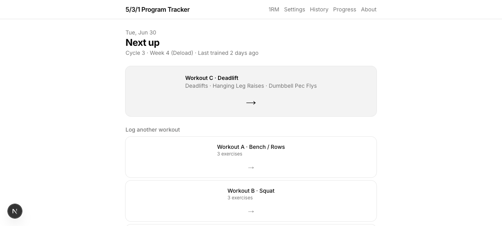
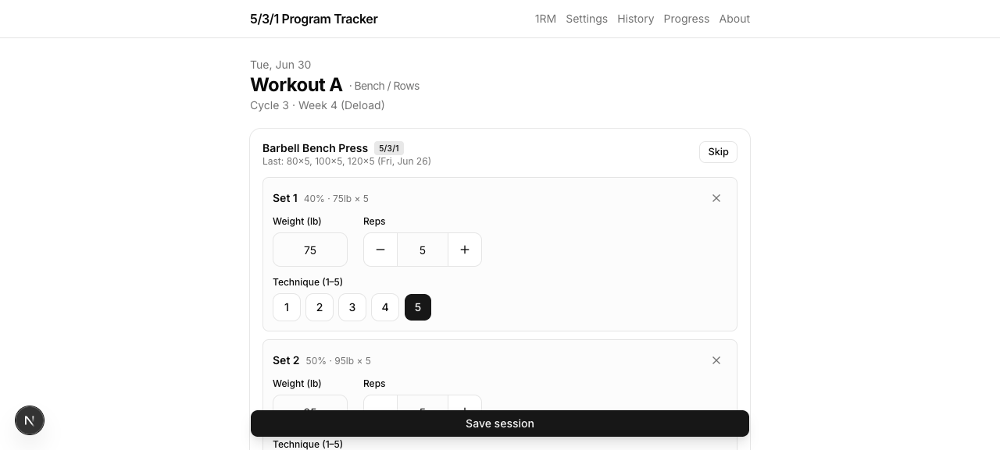
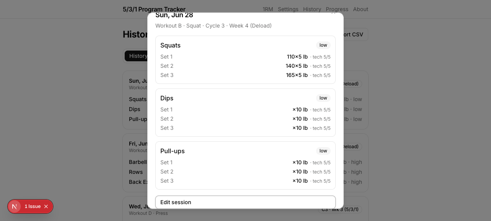
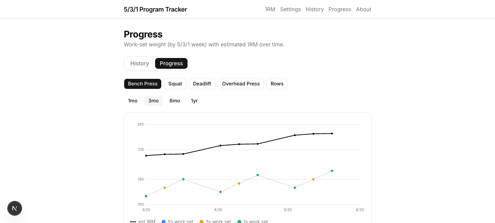
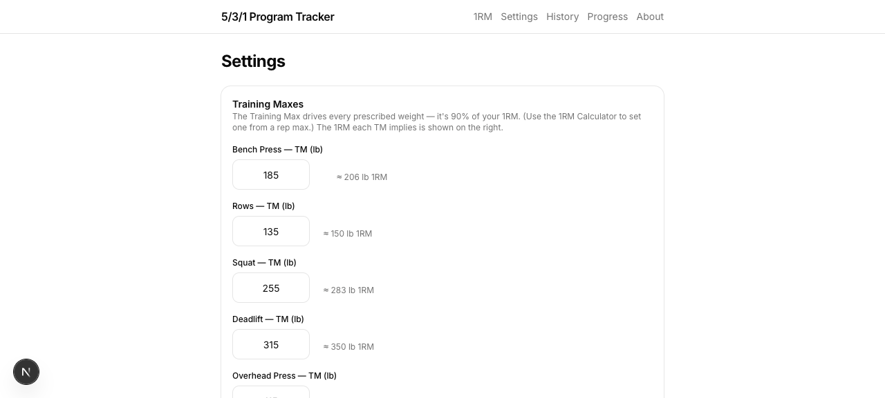

# 5/3/1 Program Tracker

A private, mobile-first web app for running Jim Wendler's **5/3/1** strength program.
It prescribes each session from your training maxes, tracks the 4-week cycle automatically,
logs every set, and charts your estimated 1RM and powerlifting total over time.

> Built end-to-end with the [Claude Code](https://claude.com/claude-code) CLI. Screenshots
> below use generated demo data (`pnpm db:seed-demo`) over a 3-month window.

## Features

### Auto-prescribed sessions
The home screen shows what's next in the rotation (Bench → Squat → Deadlift → Press) with the
current cycle/week, and links to log it.



### Set-by-set logging
Each main lift shows its 5/3/1 prescription per set (percentage × reps, AMRAP "+" on the top
set) computed from your training max, rounded **up** to the nearest 5 lb. Bench day runs both
Bench Press and Rows as 5/3/1 lifts. Accessories log freely; timed movements (e.g. Back
Extensions) log a **static hold in seconds** instead of reps. A per-exercise **Intensity** chip
and a single **Notes** field round it out. Logging the last workout of week 4 rolls the cycle
over and bumps every training max (+5 upper / +10 lower).



### History, inspection & editing
Every session is saved and browsable. Tap a card to inspect the full per-set breakdown, and
reopen any past session prefilled to edit it in place.



### Progress charts
Per lift, your work-set weight (color-coded by the 5s / 3s / 1s week) overlaid with the **Epley
estimated 1RM** from each AMRAP set, plus a **theoretical total** (squat + bench + deadlift),
across 1mo / 3mo / 6mo / 1yr windows.



### Settings: training maxes + pause
Edit each lift's training max, override the program state, and **pause the program** when
travelling, sick, or injured so logging won't advance the cycle. A 1RM calculator and CSV
export round out the app.



## Use it yourself

> **Heads up — this is built for one person.** It intentionally does **not** have a rich
> feature set or a library of exercises for customizing plans. Requests for those features will
> unfortunately be ignored, though **contributions are welcome** (see [Contributing](#contributing)).

The easiest path is to **fork this repo to your own GitHub account**, then run it locally:

```bash
# 1. Fork on GitHub, then clone your fork
git clone https://github.com/<you>/5-3-1-program.git
cd 5-3-1-program

# 2. Install tooling
#    - Node.js 20+  (https://nodejs.org)
#    - pnpm         (https://pnpm.io/installation, e.g. `corepack enable pnpm`)
pnpm install

# 3. Create the local database and seed it
pnpm db:migrate     # creates ./data/app.db
pnpm db:seed        # one user + the default exercise catalog + training-max rows

# 4. Run it
pnpm dev            # http://localhost:3000
```

Then open **Settings** and enter your training maxes (90% of your 1RM for each lift) — the app
prescribes everything from there. Want to see it full of data first? Point at a throwaway DB
and load the demo generator:

```bash
rm -f data/demo.db
DATABASE_PATH=data/demo.db pnpm db:migrate
DATABASE_PATH=data/demo.db pnpm db:seed
DATABASE_PATH=data/demo.db pnpm db:seed-demo   # ~3 months of sessions
DATABASE_PATH=data/demo.db pnpm dev
```

### Editing with an AI assistant

This whole app was written with the Claude Code CLI, so **sweeping changes are approachable**
even if you're not deep in the stack — open it in an AI coding assistant and describe what you
want. The useful entry points:

- **Exercise catalog / your split** → `src/db/seed.ts`
- **5/3/1 math** (week percentages, rounding, 1RM) → `src/lib/program.ts`
- **Pages & UI** → `src/app/*` and `src/components/*`
- **Schema** → `src/db/schema.ts` (then `pnpm db:generate` to create a migration)

### Hosting

To run it on your own always-on box, see **[docs/hosting-aws.md](docs/hosting-aws.md)** — a
single small VM behind nginx (TLS + IP allowlist), with the included `deploy/` scripts. Any
Linux VM works; the scripts assume Amazon Linux 2023.

## Contributing

PRs welcome, especially fixes and quality-of-life improvements. For larger changes, open an
issue first to discuss. Keep the app's single-user, low-config spirit; please run `pnpm lint`
and `pnpm build` before submitting.

## Stack

- **Next.js 16** (App Router, server actions, standalone output) + **React 19**
- **SQLite** via **better-sqlite3** + **Drizzle ORM** (migrations in `drizzle/`)
- **Tailwind CSS v4** + **@base-ui/react** primitives
- Hand-rolled SVG charts (zero charting dependencies)

## Scripts

| Script | Purpose |
|---|---|
| `pnpm dev` / `pnpm build` / `pnpm start` | Next.js dev / production build (webpack) / serve |
| `pnpm db:generate` | Generate a migration from `src/db/schema.ts` |
| `pnpm db:migrate` | Apply migrations to `DATABASE_PATH` (default `./data/app.db`) |
| `pnpm db:seed` | Seed the user + exercise catalog (idempotent) |
| `pnpm db:seed-demo` | Fill a DB with ~3 months of demo sessions (never run on a real DB) |
| `pnpm db:studio` | Drizzle Studio (browse the DB) |

## License

[MIT](LICENSE)

## Program reference

5/3/1 details: <https://exrx.net/WeightTraining/Powerlifting/531>
